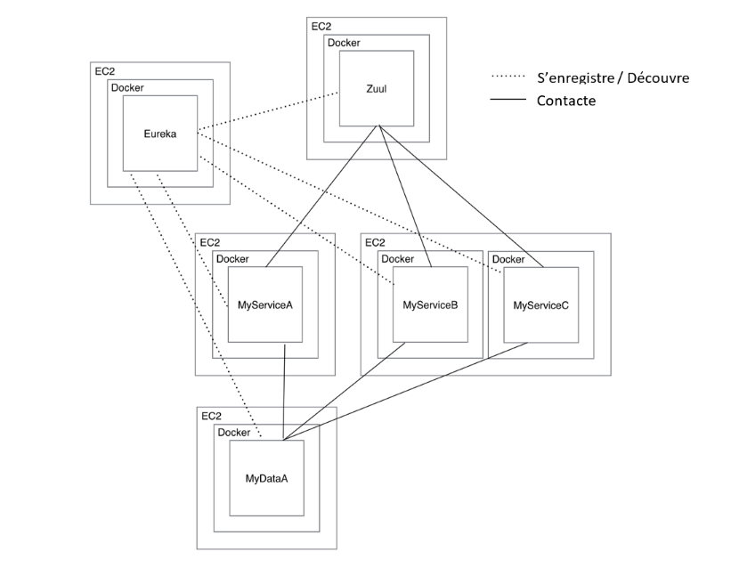

**Spring Cloud**

Spring Cloud fournis un ensemble d'outils afin de créer rapidement un système d'application distribuées.

Cela comprend la gestion de la configuration, la découverte automatisée des services, des coupe-circuit, du routage intelligent, reverse proxy, des sessions distribuées, et plus...

L'uniformisation et la coordination du système distribué permet d'avoir une structure robuste et efficace, et ce rapidement.

**Spring Eureka**

Eureka est un annuaire de services. Mais à quoi sert un annuaire de service ?

C'est un annuaire : il contient des informations permettant de contacter. Dans notre cas, ce sont des services.

C'est un outil interne au système distribué. Les services s'enregistrent auprès de l'annuaire, et ainsi, les services peuvent se contacter les uns les autres, en demandant les informations à l'annuaire.

Cela simplifie grandement les communication, car au lieux de devoir stocker des adresses ID qui peuvent changer, il suffit de connaitre le nom du service voulu pour pouvoir le contacter.

**Spring Zuul**

Zuul est une solution de reverse proxy qui va agir comme point d'entrée (passerelle vers l'extérieur) du système.

Ainsi, le client du système contacte toujours l'adresse du serveur Zuul. Ce dernier re-route ensuite la requête vers le service adéquat.

L'intérêt est donc la simplification de l'accès par le client, mais aussi la sécurité du système. En effet, s'il n'y a qu'UN point d'entrée, on réduit grandement le nombre de faille possible. On peut ensuite établir une politique de sécurité service-service, et Zuul-client.


A noter que Zuul s'intègre parfaitement à l'annuaire de service Eureka.

**Spring Config**

Rien de très compliqué avec c'est outil, il permet de centraliser les configurations du système distribué. Cela dans le but de rendre plus aisé sa maintenance.





````Spring Cloud permet d'accélérer grandement le développement d'une architecture micro-services, en proposant en plus des outils comme Zuul et Eureka, qui facilitent l'utilisation des services, leur sécurisation, et leur configuration.


Il est également possible d'ajouter Spring Security pour gérer la sécurité, ainsi le passage des sessions utilisateur entre les services.